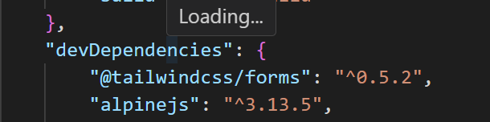
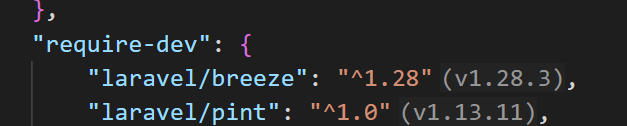
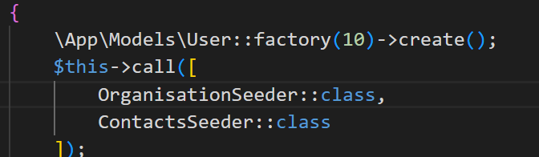
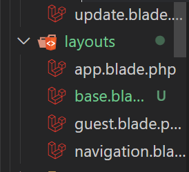
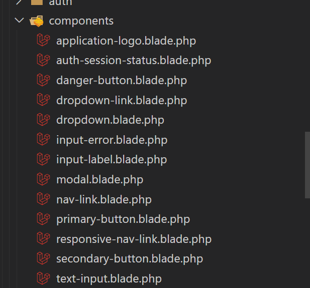

<p align="center"><a href="https://laravel.com" target="_blank"></a></p>

# Apex 
Apex is a CRM solution for apex sales.a growing B2B sales organization. To effectively track their sales pipeline across accounts, contacts, deals and activities.

## Installation

Follow these steps to get Organisation-CRM up and running:

1. Clone the repository:

```bash
cd https://github.com/Alexandranuthu/Apex-crm.git
```

2. Navigate into the project directory:

```bash
cd Apex-crm
```

3. Install the PHP dependencies:

```bash
composer install
```

4. Copy the example environment file and configure it to match your environment:

```bash
cp .env.example .env
```

5. Generate an application key:

```bash
php artisan key:generate
```

6. Run the database migrations (Set your database connection in `.env` before migrating):

```bash
php artisan migrate
```

7. Start the local development server:

```bash
php artisan serve
```

You should now be able to access the application at `http://localhost:8000`.












