<p align="center"><a href="https://laravel.com" target="_blank"></a></p>

# Apex 
Apex is a CRM solution for apex sales.a growing B2B sales organization. To effectively track their sales pipeline across accounts, contacts, deals and activities.

## Installation

Follow these steps to get Organisation-CRM up and running:

1. Clone the repository:

```bash
cd https://github.com/Alexandranuthu/Apex-crm.git
```

2. Navigate into the project directory:

```bash
cd Apex-crm
```

3. Install the PHP dependencies:

```bash
composer install
```

4. Copy the example environment file and configure it to match your environment:

```bash
cp .env.example .env
```

5. Generate an application key:

```bash
php artisan key:generate
```

6. Run the database migrations (Set your database connection in `.env` before migrating):

```bash
php artisan migrate
```

7. Start the local development server:

```bash
php artisan serve
```

You should now be able to access the application at `http://localhost:8000`.

<!-- 


## CHANGES

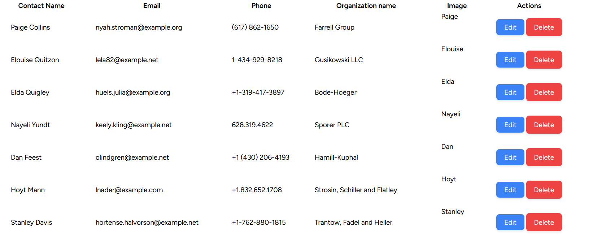

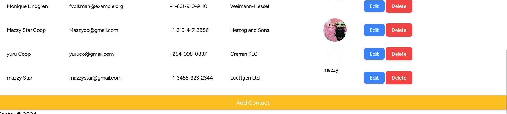

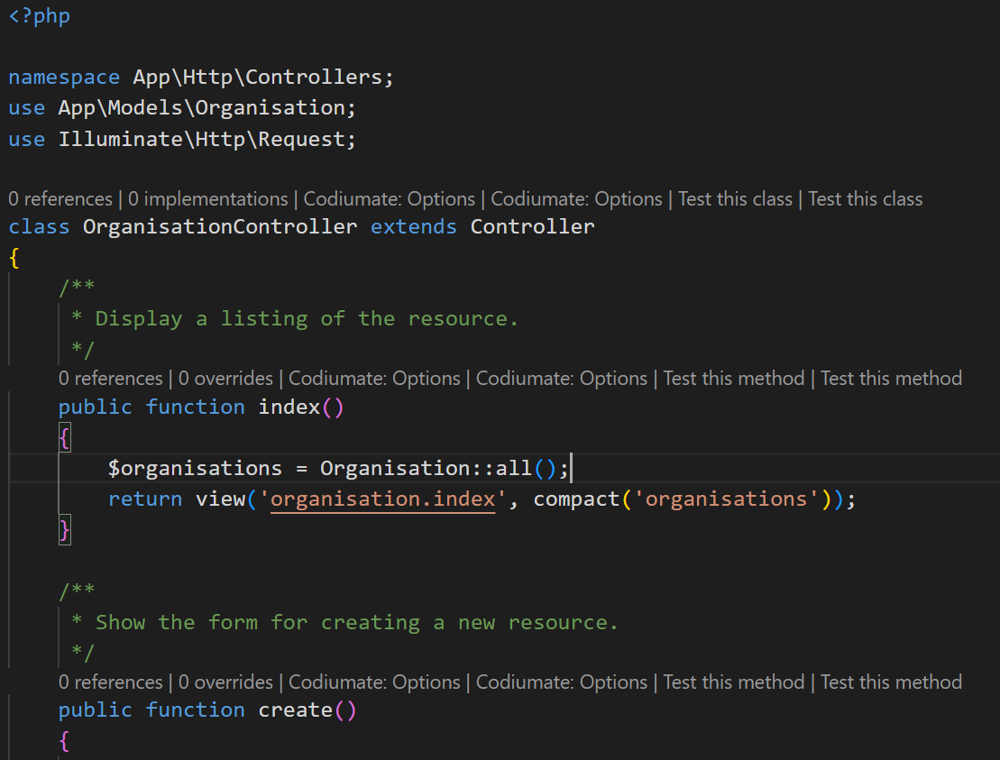

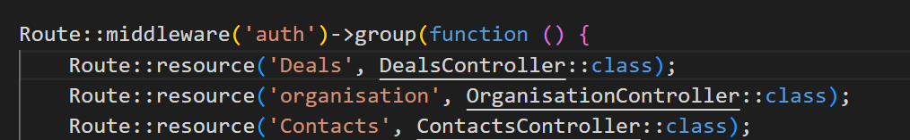

## DEALS OUTPUT
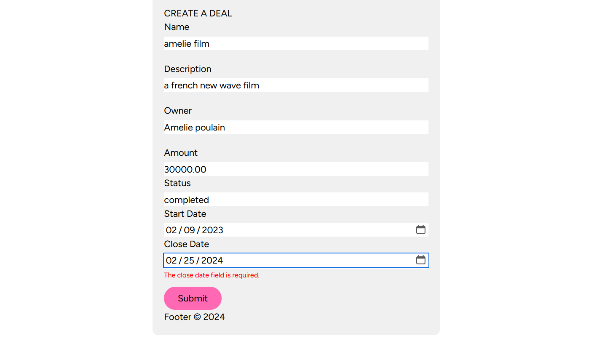

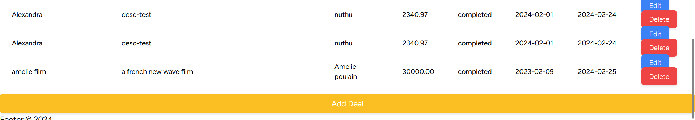 -->

## FILAMENT UI OUTPUT
Filament is a fully-featured PHP admin panel framework that provides tools for managing your application's data and settings. With Filament, you can easily create customizable admin panels for your PHP applications, allowing you to manage users, permissions, settings, and more, all through a user-friendly interface.

## INSTALLATION
To install Filament, you will need to follow these steps
1. Ensure to uninstall other starter kits before installing  Filament. You can do this by running  the following command in your terminal:
 ```bash
composer remove <package-name>
```
2. Require Filament via Composer: Add Filament to your project's dependencies by running the following Composer command:

```bash
composer require filament/filament

```

3. Publish Filament Assets: Publish the Filament assets (config files, views, etc.) to your project by running the following Artisan command:

```bash
php artisan filament:install

```
Filament provides a full installation guide in its documentation. You can find it [here](https://filamentphp.com/docs/3.x/panels/installation)

## SCREENSHOT OF MY OUTPUT USING FILAMENT
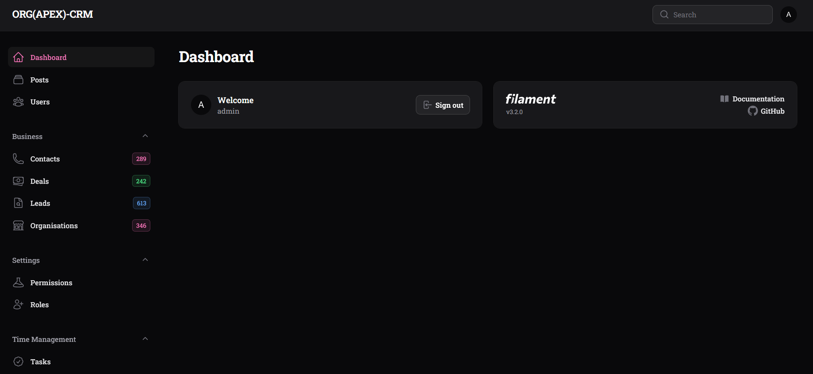

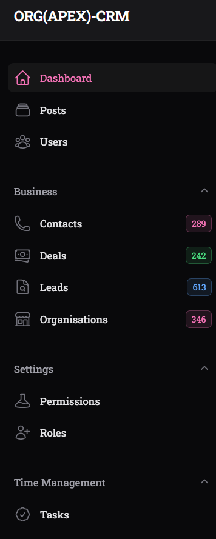

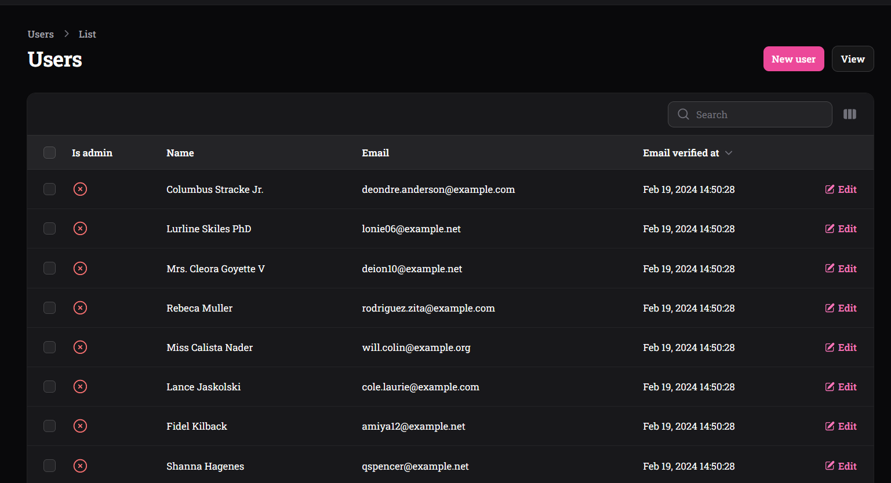

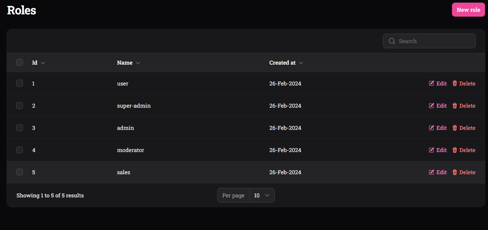

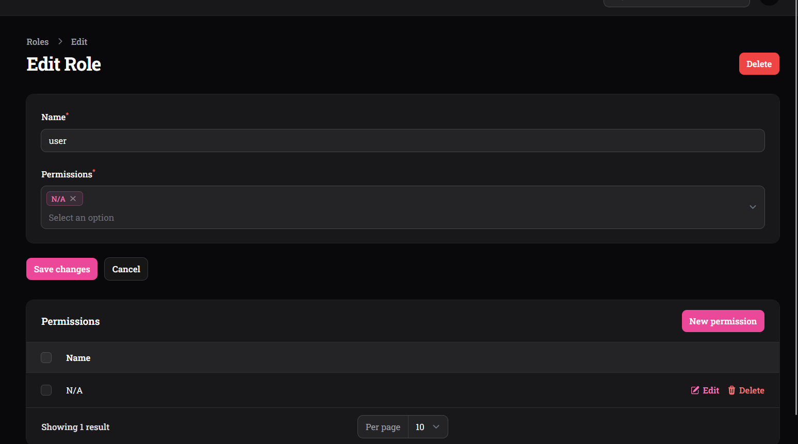

Also the model views, e.g index.blade.php e.t.c is not needed  in this project as we are using API only approach. I kept mine though for ease of review for myself.It might be helpful for my own reference or future development efforts.
In the above screenshots I have created a simple CRUD application using Filament and added some customizations as per my own preference. 
